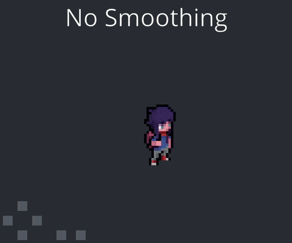
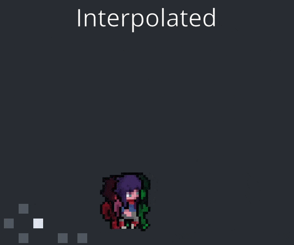
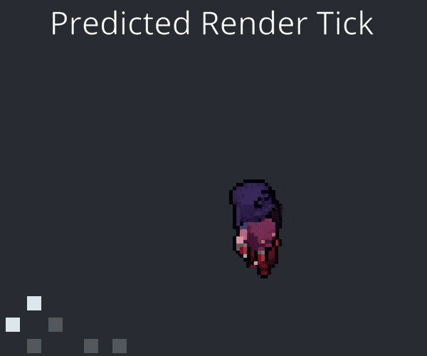
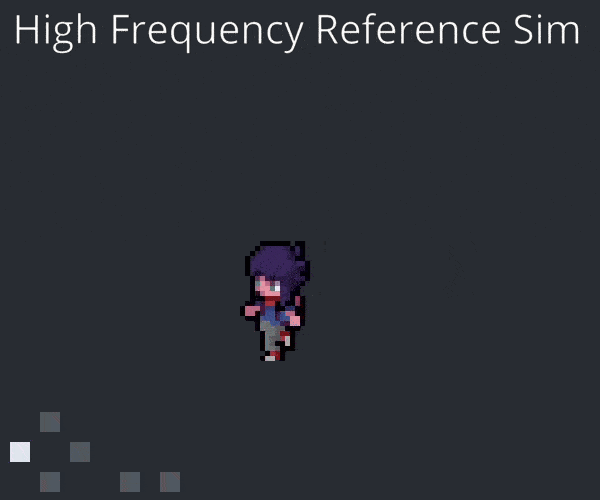

Some time ago I wrote a [blog post](https://jakubtomsu.github.io/posts/input_in_fixed_timestep/) about the tick setup in my engine, why and how I use fixed timestep update loops. It also explained how to actually use it in practice when dealing with input etc.

The general idea is this: the game would keep a accumulator timer and only simulate steps with a constant delta time, which is great for stability and predictability.

This was mostly inspired by server code for multiplayer games, so I naturally also implemented game state interpolation, which multiplayer games use as well. However I have some issues with regular interpolation, it adds unnecessary latency and it's also annoying to implement.

Turns out there are other ways to do it! It's possible to use the game tick to "predict" the render game state without explicitly writing any interpolation code. That's what this post is about.

I also made a [Demo](#demo) program which implements all of the different methods mentioned.

# The "old" way

Here is what the **old** game loop looked like. The game kept track of the game state from the previous tick, and then used this for interpolation with the time remainder.
```go
DELTA :: 1.0 / 60.0

accumulator: f32
game: Game
prev_game: Game
prev_time := time.tick_now()

for !quit {
    frame_duration := f32(time.duration_seconds(time.tick_since(prev_time)))
    prev_time = time.tick_now()
    accumulator += frame_duration
    for ;accumulator > DELTA; accumulator -= DELTA {
        runtime.mem_copy_non_overlapping(&prev_game, &game, size_of(Game))
        game_tick(&game, DELTA)
    }
    // Remainder to go from fixed time to real time.
    // Always in 0..1 range.
    alpha := accumulator / DELTA
    // Interpolates between T-1 and T game state with the alpha factor.
    game_draw(game, prev_game, alpha)
}
```

# Can we do better?
The fundamental issue is that the fixed timestep simulation does as many timesteps as possible, however because the frame-rate is variable the real time doesn't always match the fixed time.

So the solution is very simple, after the fixed timestep simulation is done, we need to simulate one more additional tick with the remainding time. However this additional tick could mess up our game state, because the time step is no longer fixed.

For this reason we **duplicate** the entire game state into a new, temporary render-only game state, and simulate the tick on this one. That way the fixed timestep game state stays untouched.

```go
DELTA :: 1.0 / 60.0

accumulator: f32
game: Game
temp_game: Game
prev_time := time.tick_now()

for !quit {
    frame_duration := f32(time.duration_seconds(time.tick_since(prev_time)))
    prev_time = time.tick_now()
    accumulator += frame_duration
    for ;accumulator > DELTA; accumulator -= DELTA {
        // Simulate the game state (without keeping T-1 game state!)
        game_tick(&game, DELTA)
    }
    // Remainder to go from fixed time to real time.
    // Always in 0..DELTA range.
    alpha := accumulator
    // "Create" a duplicate version of the game state so our
    // "render tick" doesn't affect the real game state.
    runtime.mem_copy_non_overlapping(&temp_game, &game, size_of(Game))
    // Simulate the temp state forward in time to match reality.
    game_tick(&temp_game, alpha)
    // No need to do any interpolation now, just render the game state as it is.
    // It matches real time pretty much perfectly.
    game_draw(temp_game)
}
```

> Note:
> This method probably won't work very well in cases when `game_tick` can take a very significant amount of time, or the game state is gigantic, e.g. in a big AAA game which needs to run the physics engine and whatnot.

## Game state duplication
In a more traditional system with individually dynamically allocated objects this might be bit of an issue.
Even if your language can do a _deep copy_ of an object which holds the game state, the individual allocations could take a long time or it could make the GC sad.

In my case the _entire_ game state is trivially copyable, because:
1. I never store any pointers. ever. Only integer indexes or handles.
2. All of the datastructures are fixed size, no dynamic allocations.

That means I can easily do `memcpy` and get a duplicate game state without any issues. This setup makes things a whole lot easier to deal with.

## What about input?
Just like the last time, the `game_tick` needs to get the input from somewhere. This is easy, because the main update loop is pretty much the same like in the interpolation case! So the solution from my original post still applies, you can just use a separate `frame_input` and a `tick_input`.

But what about the temp render tick?

But I found re-applying the `tick_input` in exactly the same way as in the fixed update loop works decently well. You also want to clear the "pressed" and "released" flags from the input, because those were already applied in the fixed update loop. If you use my implementation from previous article you don't need to do this directly, the fixed update loop does this on it's own anyway.

So here is how to accumulate the input states every frame:
```go
tick_input.cursor = frame_input.cursor
// _accumulate_ temp flags instead of overwriting
for flags, action in frame_input.actions {
    // Bitwise OR the bit flags
    tick_input.actions[action] += flags
}
```
And this is how to apply it. Note how the temp flags are cleared after every tick, and all flags are cleared at the end of a frame when any tick happened.
```go
any_tick := accumulator > delta
for ;accumulator > delta; accumulator -= delta {
    game_tick(&game, tick_input, delta)
    input_clear_temp(&tick_input)
}
runtime.mem_copy_non_overlapping(&temp_game, &game, size_of(Game))
game_tick(&temp_game, tick_input, accumulator)
game_draw(temp_game)
if any_tick do tick_input = {}
```
(see the [Demo](#demo) source code for the full implementation)

## Different TPS is a fundamentally different problem
Something I've realized while working on this post and the Demo is how different the problem you're trying to solve is, depending on your TPS. So here is what I think is a good way to roughly categorize it:

- ~10 TPS: Here the way you render the in-between game states matters _a lot_. Latency from interpolation is _huge_ but the predicted render ticks can be jittery because of different simulation results. And the exact way you accumulate inputs and how you pass them in the game matters a lot as well. This is completely unusable for any kind of real time action game.

- 30-60 TPS: This is the most common for regular games. In this case the render tick method works really well, because there is almost no jitter due to input sampling inaccuracies. But the smoothing is still very visible. The added latency from interpolation is not _that_ noticeable. However if you're making a fast-paced action game, you probably want to eliminate every millisecond of unnecessary latency.

- ~120+ TPS: At this point any kind of interpolation accounts for only a tiny fraction of a second. The only reason you might want to use it to remove some jitter, but it's just not very significant.

### Accumulated render tick
In case you wanted to run only a very small number of fixed update ticks per second, the basic render tick method described above has some limitations. The temporary render tick always uses the last fixed tick, which means as your fixed delta increases your render tick might be doing a single, very large time step.

> This is not an issue in most singleplayer PC games. That's because you _probably_ want to simulate >30 ticks per second anyway, for stability reasons and just because there is no reason to push TPS lower.

The solution is to copy game state into temp game state _only_ if you simulated a fixed tick that frame. Otherwise you keep simulating the old temp game state. This also means you need to keep another separate remainder timer, because alpha is no longer valid for each render tick.

This is similar to client-side prediction in real-time multiplayer games.

One issue is jitter, the difference in frequecy of input between fixed and predicted ticks is so significant the render game state can get out of sync. One solution is to interpolate to sync the game states instead of doing that instantly. Alternatively you could modify the render tick inputs to eliminate high frequency inputs, and maybe even completely disable "pressed" and "released" key events.


I don't do this in my game, simply because I didn't run into issues with the current, simpler approach. But I thought I should mention it anyway.

# Demo

I wrote a small demo game in Odin and Raylib to demonstrate the different fixed timestep rendering methods.

**See the [Github Repository](https://github.com/jakubtomsu/fixed-timestep-demo) for source code.**

Here is how the various simulation modes look like when running at 4 ticks per second. This is a very low TPS only for demonstration purposes.

Without any kind of smoothing at all the game is very choppy:



The regular interpolation looks smooth but it's a bit delayed (the "onion skinning" shows the current game state drawn as green, previous as red):



This is the regular render tick method, it looks fairly smooth and importantly there is no lag:



Here is a very high TPS sim just for comparison:



## Overview
Let's summarize the all the different methods from the demo and how they compare to each other. There is no clear winner, it depends on your engine, game and your circumstances.

- Interpolation: Always smooth. Needs a way to interpolate two game states, this can be a pain to implement. Always lags one tick behind - this means worse latency, especially with low TPS.

- Render Tick: No added latency, matches real time "perfectly". Very easy to implement, especially if your game state and tick is set up in a nice way. However the single render tick can get inaccurate with low TPS because each update step is linear.

- Accumulated Render Tick: More accurate in low TPS simulations, however because of the input frequency is so different between the predicted and the fixed ticks it can get out of sync.

> In my case, I'm making a fast paced singleplayer game and I have no issue setting the TPS to 30 or even 60. For this reason the Render Tick is by far the best fit.

# Tangent: determinism and replay
This isn't related to the main topic of this post, because it applies to any kind of gameplay where the timestep is fixed (it doesn't matter whether you use prediction or interpolation). But if your gameplay is deterministic, meaning you always get the same game state T+1 by simulating game state T with the same input, there is a neat trick to do game replay.

Regular replay systems would have to periodically store the game state, which ends up consuming a lot of memory, even if you try to compress it. But if your game is deterministic you only need to store the _starting_ game state (or even just the starting settings to generate the game state), and then inputs for all the fixed timesteps. Then when you can just simulate the original game state N times to get any tick you want, once you need to do the replay.

By the way, this is what Media Molecule does in Dreams. The Trackmania racing games do this as well, to verify runs and make sure people aren't cheating. Even their 3d physics engine is fully deterministic! very cool stuff.

> Notes:
> 1. You need to make sure entities are always updated in the same order. This means deterministic O(1) datastructures like pools are your friend.
> 2. If you use random numbers then you need to make sure the seeds match at the start of every tick as well. You can probably get by storing only one seed along with the first
> 3. The stored replay gets invalidated once you change your gameplay logic, so this method is generally useful for debugging only.

# That's all!
Thank you for reading, I hope this can be useful in your engine/game project! Also let me know if you have any feedback, if you know how to improve any of the methods I explained here, or you know of an even better method:)

## Credit

After I published the original blog post, a number of people messaged me it helped them with use fixed timestep update loops in their game/engine as well. However some people complained specifically about the interpolation step, it can be kinda cumbersome to do, especially if you want to interpolate more properties than just the entity transform.

I was told about the render tick method by `poyepolomix` on discord, a fellow handmade programmer. He uses it in his engine as well! And he found out about it from an old [Jonathan Blow Q&A stream](https://youtu.be/fdAOPHgW7qM?si=chCqgUTNoOLuHDvy) which is a much more in-depth explanation of this entire topic.
