This is an behind-the-scenes look at my design process for the first iteration of a logo for my new game, BEHEADER.

I use Krita, it's a pretty good and free photoshop alternative. It doesn't have all of the fancy features but there are enough filters for me to do all I need.

## Basic Shape

I started with a basic text with gothic font (Old English Text MT). This serves as a base for everything else. I duplicated the layer and "flattened" it so I can work with the pixels instead of the vector representation.

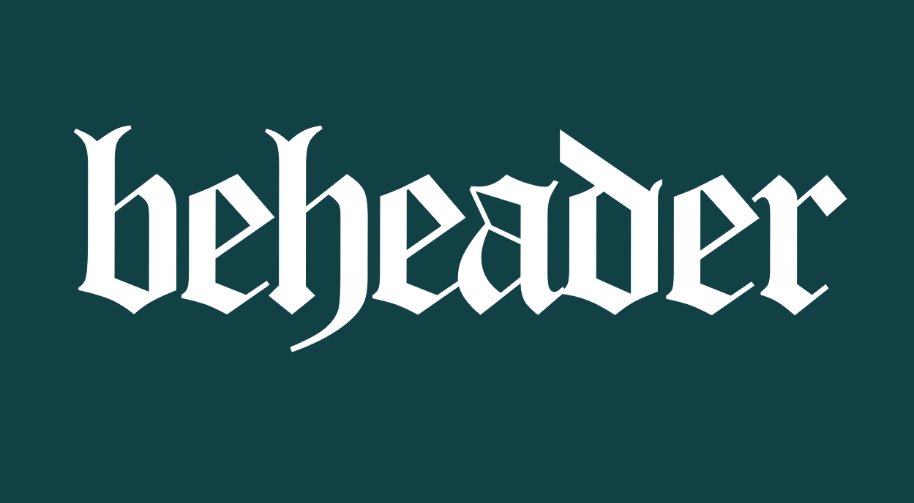

Then I added distortions using the transform tool. First I added a bit of perspective to make the bottom larger, then I used the warp tool to make the center curve up a bit. And then I used the liquify tool as a brush to distort it even more and add those spiky details.

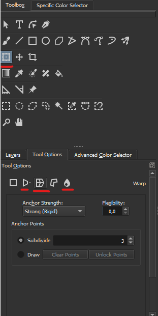

Here is what it looks like after all those distortions:

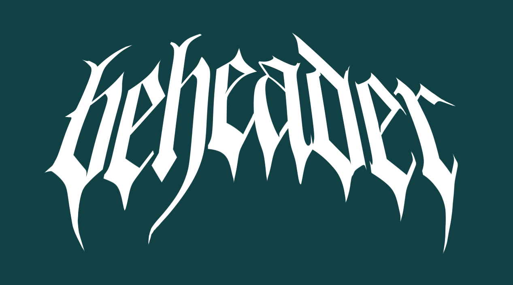

## Shading

Now the shape looks good, let's add the colors. I wanted the reflective chrome effect with lighting etc, so I started by generating a normal map.

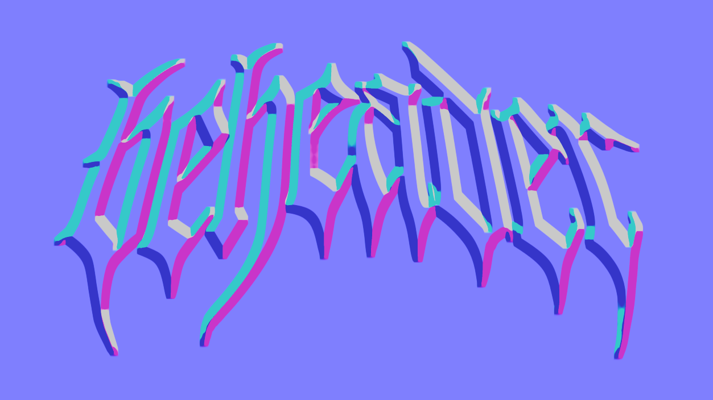

But the default normal map is kinda flat, so let's just use the Gaussian Blur filter to smoothen it out a bit.

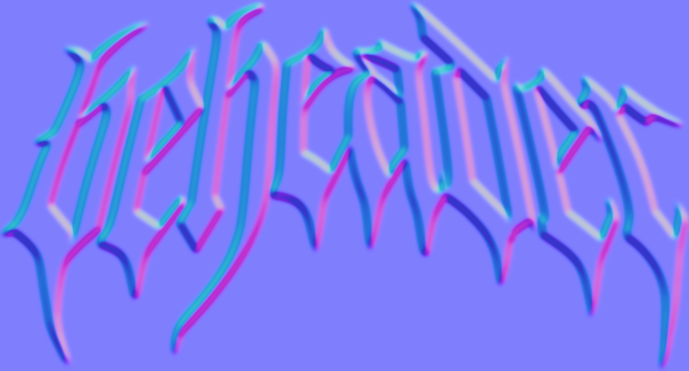

And since I only care about the "Y-axis normal", I removed the red and blue channels, and then desaturated it to get this black and white texture:

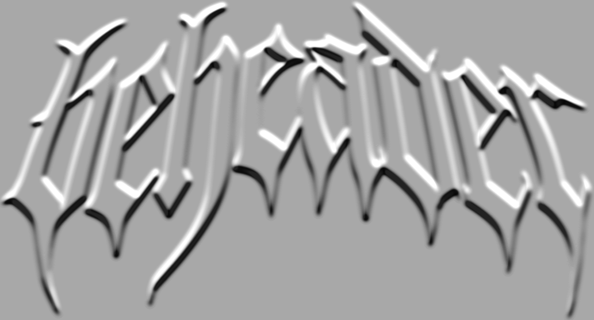

Okay, that's all we need to start doing the shading. I used a Gradient Map filter to map specific brightness to some cool colors.

I also used dithering with a grunge texture instead of the default linear interpolation. This depends on the style you're going for.

> Pro tip: you can click the "Create Filter Mask" button in the filter settings to create a non-destructive filter layer.

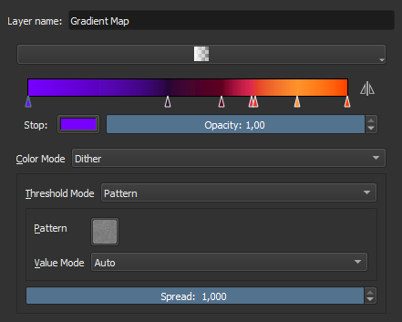

And here is what it looks like with the gradient:

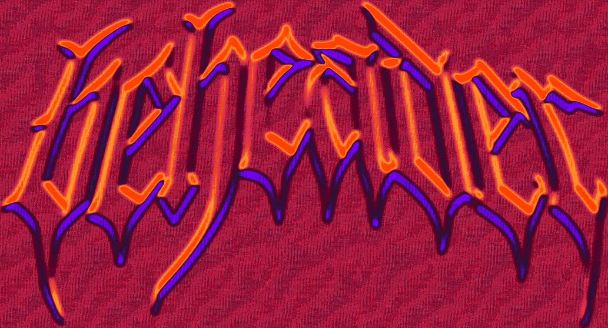

## Finishing

But because the normal map and blur filters changed the text borders, we need to somehow mask it to make the edges crisp again. I did this by duplicating the original white texture and inverting the alpha (with color curves). Then you place this layer above all other layers and it clips everything correctly.

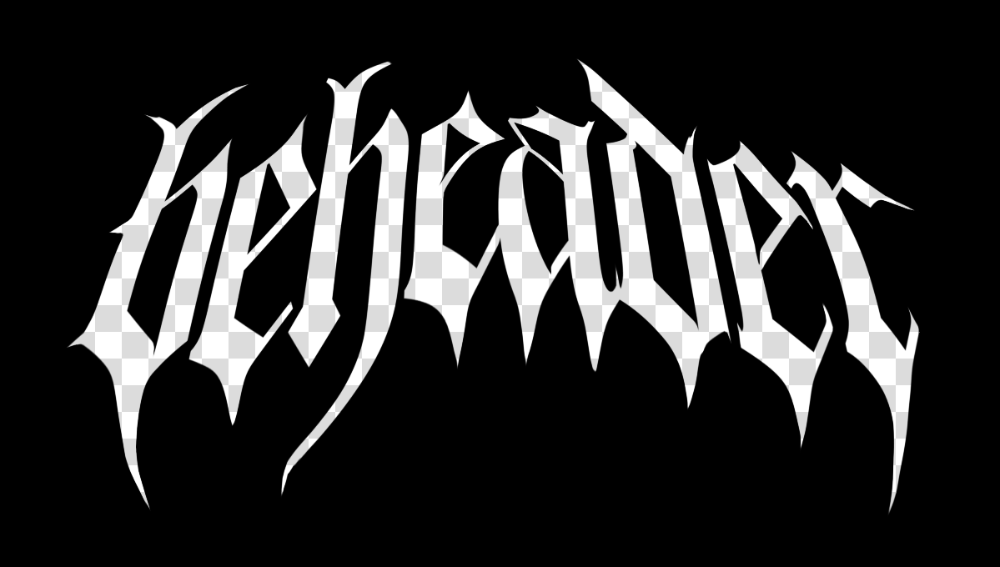

And this is the final result! I'm happy with it, especially since it's the first iteration of the logo. I still plan on improving it before I launch the Steam Page. I think I would like to make it all caps instead, and also improve the readability a bit.

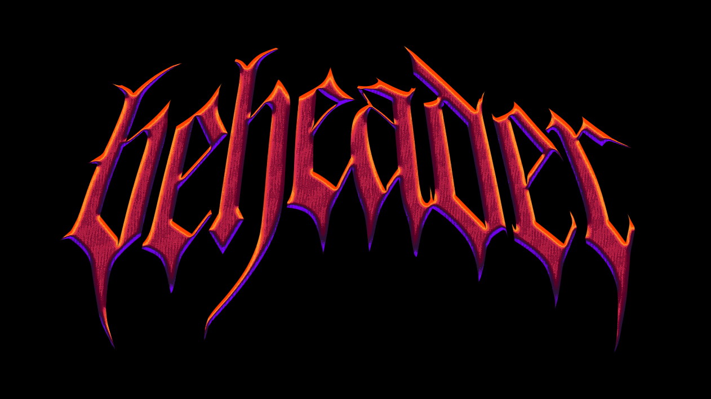

## Alternative shading method: blinn Phong lights

Here is anoter color combination I made. Instead of gradient map I used the phong shading filter which lets you set up lights from various directions.
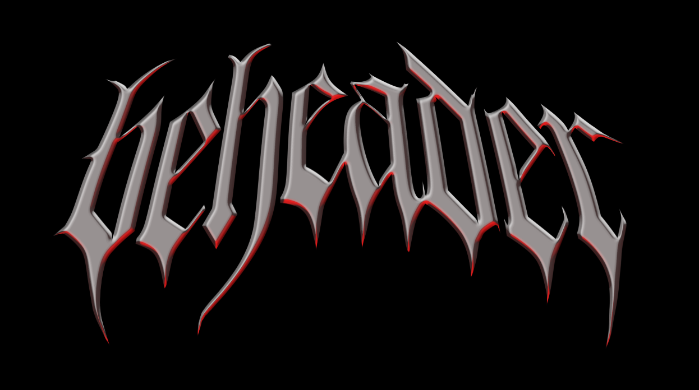

I used the following settings to sort of a metal material.
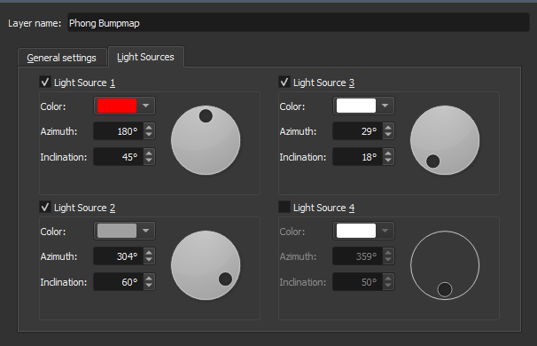

And here is the settings for light sources, many possibilities here
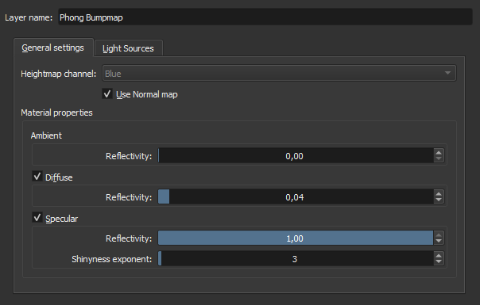