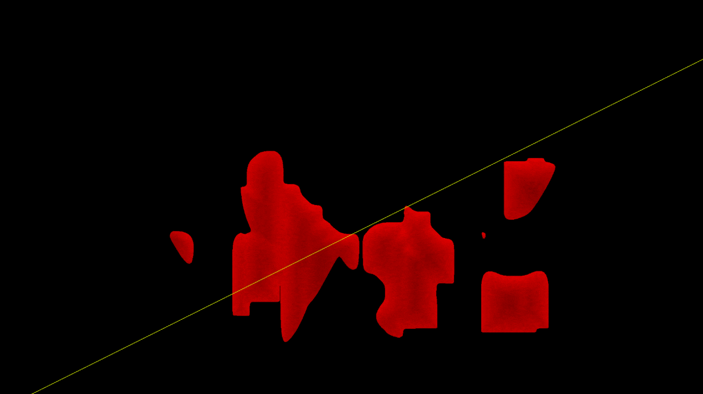
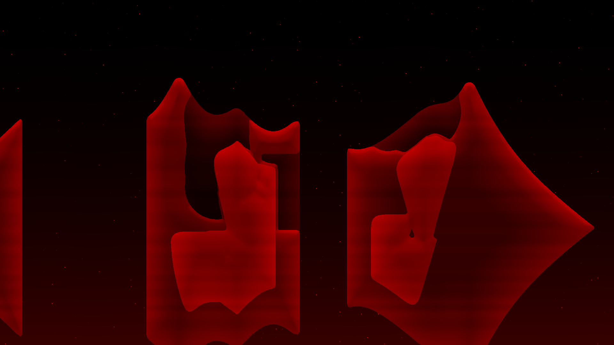
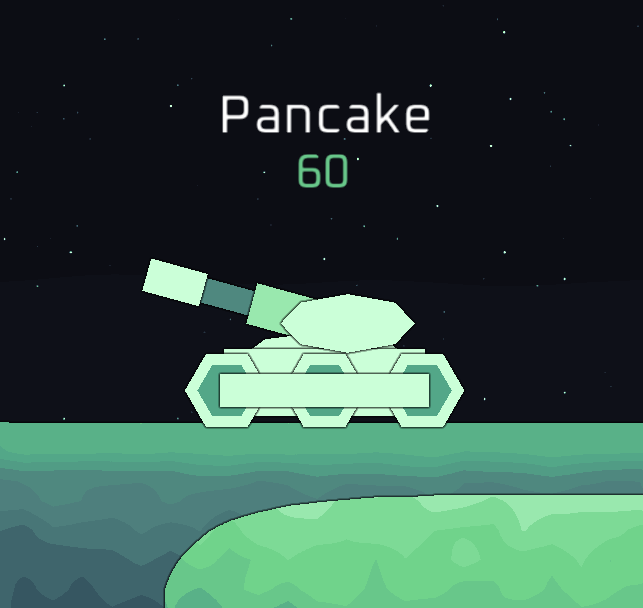
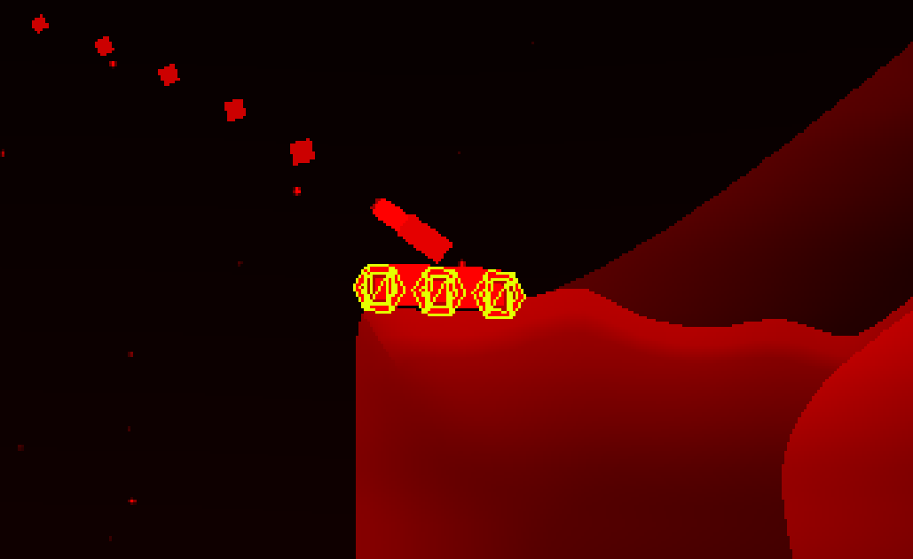
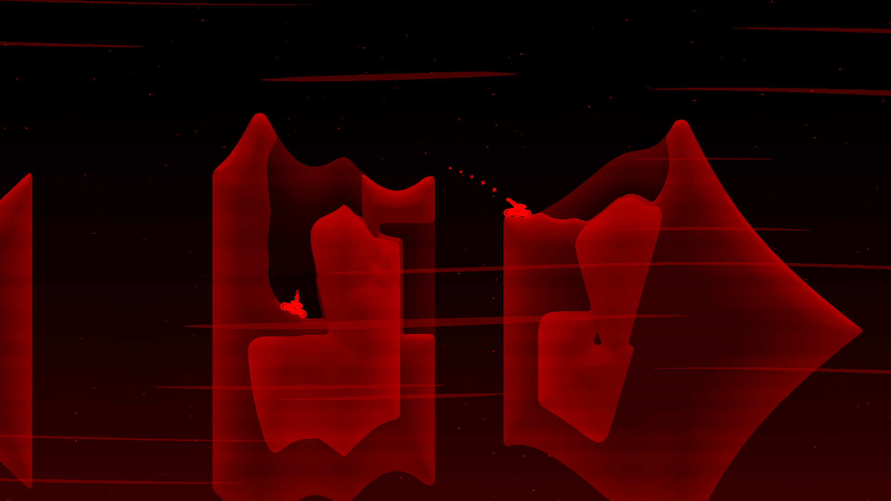
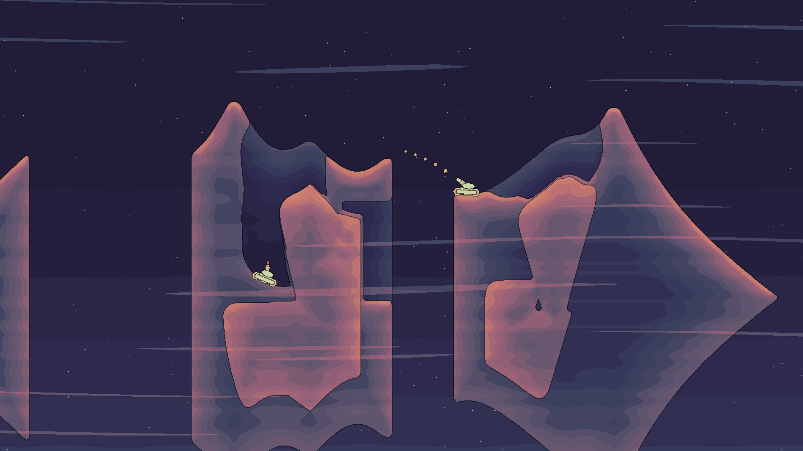
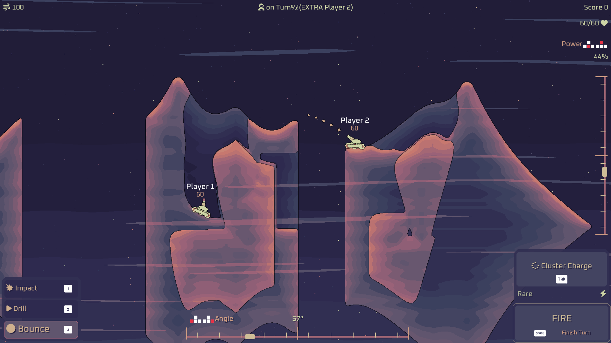
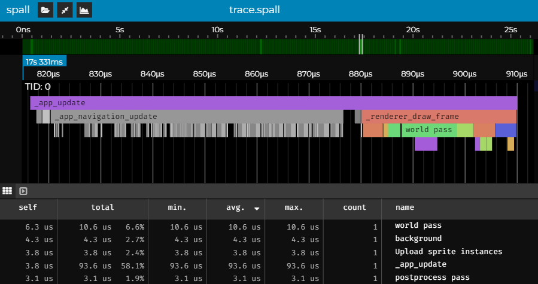
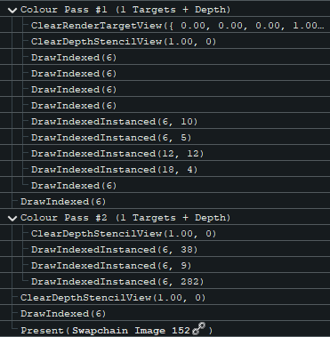

Solar Storm is an upcoming tactical sci-fi artillery game. It’s a solo project I’ve been writing in a custom engine for the last ~4 months. It’s inspired by local multiplayer games from the 90s like Scorched Earth (1991) and Worms (1995). The entire game is written from scratch in the [Odin programming language](https://odin-lang.org).

### [Play Solar Storm on Steam](https://store.steampowered.com/app/2754920/Solar_Storm/) and [Join our Discord!](https://discord.com/invite/wn5jMMMYe4)

The game engine is built with the help of [Sokol](https://github.com/floooh/sokol). It’s a set of STB-style cross-platform libraries for C/C++, with an official support for Odin as well as some other languages. In particular, I use sokol_app for windowing and interfacing with the OS, and sokol_gfx as an rendering API abstraction.

Similar to libraries like SDL2 or GLFW, `sokol_app` provides a cross-platform API for interacting with the OS. But like all other sokol modules, it's just a single, lightweight C/C++ header file, which makes it really nice to work with.

So let’s talk about the Solar Storm rendering a bit. The entire renderer is built on `sokol_gfx`, with custom shaders, render passes, and all that fun stuff.

Here is a sneak peek at the different steps of the rendering process:


# Shaders

The shaders are written in Sokol’s flavor of GLSL, which has a cross-platform shader compiler called sokol-shdc. Usually writing shaders for multiple rendering APIs is a lot of pain. But sokol-shdc uses libraries like GLSLang, SPIRV-Tools, SPIRV-Cross to transpile them for the appropriate platform.

Another nice aspect is that the compiler can generate source code and boilerplate for any language supported by Sokol. Here is an example command of compiling shaders with `sokol-shdc`:
```
sokol-shdc.exe -i shaders.glsl -o shaders.odin -l hlsl5:glsl330 -f sokol_odin
```

And here is how a simple sokol-style GLSL looks like:
```glsl
@vs vs
uniform vs_params {
    mat4 mvp; // transformation matrix for current mesh
};
in vec4 position;
in vec2 texcoord0;
out vec2 uv;

void main() {
    gl_Position = mvp * position; // transform vertex position
    uv = texcoord0; // pass mesh UVs to fragment shader
}
@end

@fs fs
uniform texture2D tex; // Note the texture and the sampler is separated
uniform sampler smp;
in vec2 uv;
out vec4 frag_color; // pixel color

void main() {
    frag_color = texture(sampler2D(tex, smp), uv);
}
@end

@program foo vs fs
```

# Immediate-mode APIs are amazing

A core philosophy of the renderer is to do as much as possible with [immediate-mode APIs](https://caseymuratori.com/blog_0001), and group rendering operations so Instancing is trivial.

Immediate-mode APIs are well known for UIs, but the core idea can actually be applied to almost any context. In games, where you often do an action every frame, the idea is incredibly powerful. I use it many places in the engine, for things like collision, physics, drawing shapes and text, UI, debug gizmos, localization and particle effects.

The game uses immediate mode API exposed by the renderer for all drawing operations. Each frame game calls `draw_shape`, `draw_text`, `draw_sprite` and `draw_ui_rect` to draw everything. That includes players, particle effects, ImGui system, projectiles and explosions. This way it becomes much easier to do dynamic effects, since there is no state at all that needs to be managed. Here is an example of drawing simple animated octagon which rotates over time:
```odin
draw_shape(
   pos = {0, 0},
   scale = 10,
   rot = time_passed(),
   color = COLOR_RED,
   z = 0.1,
   shape = .Octagon)
```

Immediate-mode text drawing has an interesting benefit of dynamic animations. The `draw_text` procedure returns a slice of the text character instances, so you can do any modifications yourself. Here is a simple example:
```odin
chars := draw_text({100, 200}, "Hello world!")
for &ch, i in chars {
    ch.pos.y += sin(time_passed() + f32(i)) // animate up and down
}
```
This code runs every frame, and updates the character instances right before being submitted to the GPU and displayed. There is state in the background, but the API is fully immediate-mode. _immediate-mode != stateless_


# World pass
The terrain is drawn as a single quad. A shader which reads from the terrain SDF texture and a color texture and does the shading. Explaining the terrain in-depth is out of scope for this article, let's do that another time...

There is also a shader for rendering the background and another one for wind. The background shader draws stars using perlin noise raised to a very high power. The wind is also just perlin noise, but this time it’s stretched horizontally and has some distortion to add some _wiggle_.



All world-space elements are rendered into a custom render target. It's a texture with single channel per pixel in the R8_UNORM format. This pass also uses a depth buffer for ordering objects instead of sorting. It's essentially free on modern hardware and it makes things easier.

## Shapes

All of the other things in the game are rendered using primitive shapes. Every frame, the game pushes shape instances to instance buffers, which then get uploaded to the GPU memory once it’s time to render them. This uses an immediate API in the form of `draw_shape` procedure.

There is one instance buffer per shape type. It’s a simple fixed array of a shape instance struct, which has a memory layout the GPU can feed to the vertex shader in the form of per-instance parameters.

Here is the full list of supported shapes in the game as of now.
```odin
Renderer_Shape :: enum u8 {
    Triangle,
    Rectangle,
    Rhombus,
    Pentagon,
    Hexagon,
    Octagon,
}
```
> Fun fact: the reason there is both rectangle and a rhombus is because they have different properties when doing non-uniform scaling. Rhombus is primarily used for sparks and other particle effects.

More complex shapes like tanks are made up of multiple shapes.


This is the shape instance struct, as it is handled both on the CPU and the GPU side. It's 32 bytes with alignment, which could be significantly reduced but probably isn't worth the effort. The `right` and `up` vectors have baked in rotation and scale, so they work like a 2x2 rotation matrix.
```odin
Renderer_Shape_Instance :: struct {
    pos:   Vec3, // world-space position
    right: Vec2, // local-space vector pointing to the right. 
    up:    Vec2, // local-space vector pointing up
    color: Color8, // RGBA8_UNORM color
}
```

Here is all the state renderer keeps for shapes. The pipeline is shared for all shape types, and the buffers are created at load time. `shape_instance_bufs` are filled with instances from `shape_instances` prior to rendering. `Array` is just `struct { data: [N]T, len: int }`, it's a custom version of odin's `core:container/small_array`.
```odin
shape_pipeline:      sg.Pipeline, // shader for all shapes
shape_vertex_bufs:   [Renderer_Shape]sg.Buffer, // mesh vertices for each shape type
shape_index_bufs:    [Renderer_Shape]sg.Buffer, // mesh indicies for each shape type
shape_instance_bufs: [Renderer_Shape]sg.Buffer, // GPU buffer for instance data
shape_instances:     [Renderer_Shape]Array(BUDGET_MAX_RENDERER_SHAPE_INSTANCES, Renderer_Shape_Instance),
```

All shapes of certain type are rendered using GPU instancing, this means it takes only about 6 drawcalls to render all shapes in the worst case. Here is how the game dispatches draw calls. Note: this code is a heavily simplified for the sake of clarity.
```odin
sg.apply_pipeline(renderer.shape_pipeline)
// Apply projection matrix
sg.apply_uniforms(.VS, shaders.SLOT_shape_vs_params, sg_range(&shaders.Shape_Vs_Params{mvp = mvp}))
// For each shape type...
for &arr, shape in renderer.shape_instances {
    // Clear the instances when done, since it's immediate-mode
    defer clear(&arr)
    
    // Upload the instance data for a particular type to the GPU
    sg.update_buffer(
        renderer.shape_instance_bufs[shape],
        {ptr = &arr[0], size = u64(size_of(Renderer_Shape_Instance) * len(arr))})
    
    // Bind the mesh
    sg.apply_bindings({
        vertex_buffers = {
            0 = renderer.shape_vertex_bufs[shape],
            1 = renderer.shape_instance_bufs[shape]},
        index_buffer = renderer.shape_index_bufs[shape]})

    // Dispatch the drawcall for all instances of a shape.
    // Single 'DrawIndexed' call when using D3D11
    sg.draw(
        base_element = 0,
        num_elements = shape_num_elems[shape],
        num_instances = len(arr))
}
```

Here is an example of one drawcall, in this case hexagons:


That's it for the world render pass, here is the result so far:


# Postprocess pass

In the post processing pass, a shader takes the single channel world texture and does all post processing. That includes water reflections, palettization and outlines (in order).

The water relections involve calculating the UV coordinate from the reflected world-space coordinate, which is then sample the world texture again. So this is completely done in screenspace. The UV coordinate is also distorted with 1D and 2D perlin noise to make the surface look like actual water waves. The reflected color is also darkened the further from the water surface it is, and a soft vignette is applied around screen edges to make the transition smoother. The reflection is then blended with the world behind the water.


The palettization is there to convert the single-channel value to a RGB color. The value is used as an UV coordinate for looking up a color from a palette texture. Each biome in the game has a combination of colors to make it look more unique. The palette texture uses Nearest sampling mode, which is a stylistic choice.


Finally, the outlines are applied. Each pixel compares the depth value to it's neighbors in a 5x5 block, and calculates outline weight based on that. The outline is applied to the already palettized color, to make it go towards pure black instead of the darkest palette color. It improves clarity, especially in biomes with a palette without much contrast.



# Screenspace pass

Then all text character, icons, sprites and UI rectangles get drawn on top of the postprocessed image. There is nothing fancy about this step, but again, everything is drawn with just a couple of draw calls. This pass uses the depth buffer for ordering UI and text elements.

The UI, icons and text rendering are a big topic on their own, so I'll leave that for later. I'm also considering switching from my own custom text rendeing to FontStash.



# Display pass

And that’s it for the rendering! The last render pass just draws the final image to the actual swapchain texture, which gets displayed on your monitor.

# Conclusion

The renderer spends up to 50 microseconds on the CPU submitting the commands. At the time of writing, it takes around 100 microseconds on a RTX2060 to actually draw everything.

This is a trace using Spall:


And here is the entire renderdoc capture of the game. The entire thing is just a couple of draw calls and buffer uploads.


