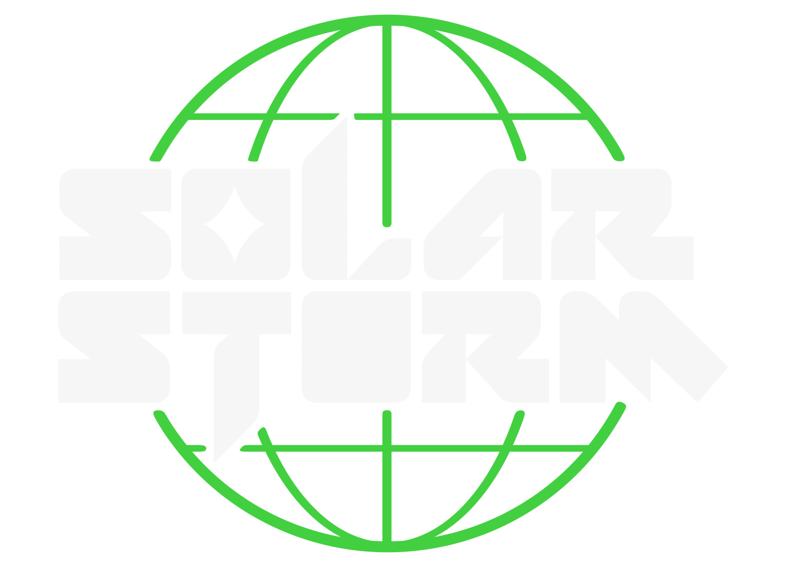
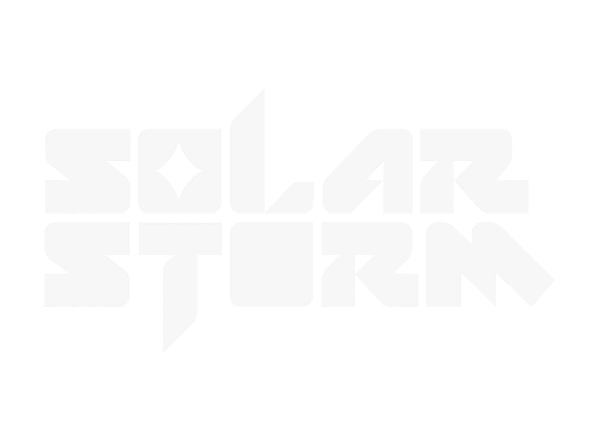
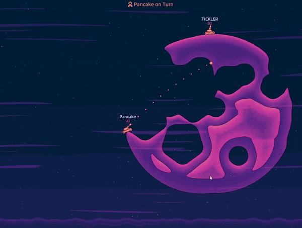
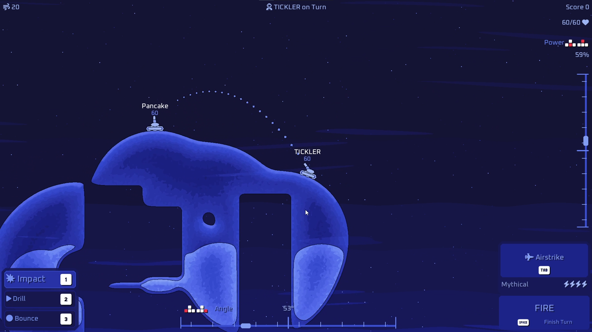
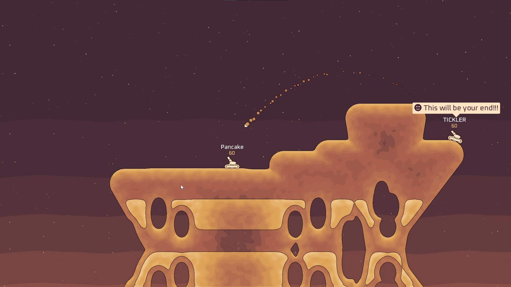
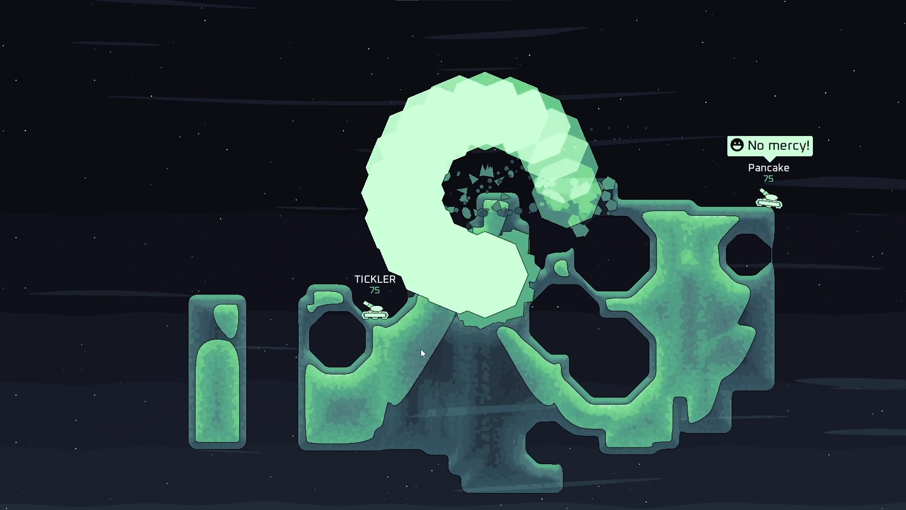
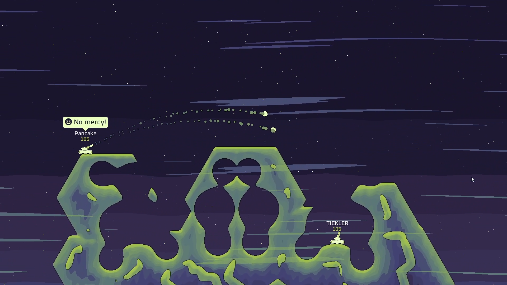
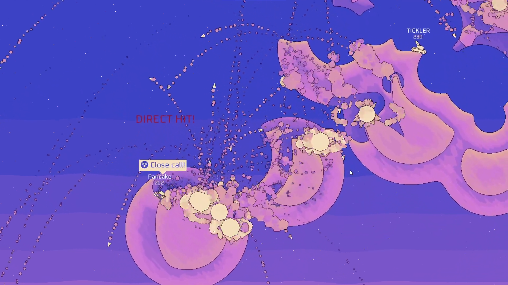
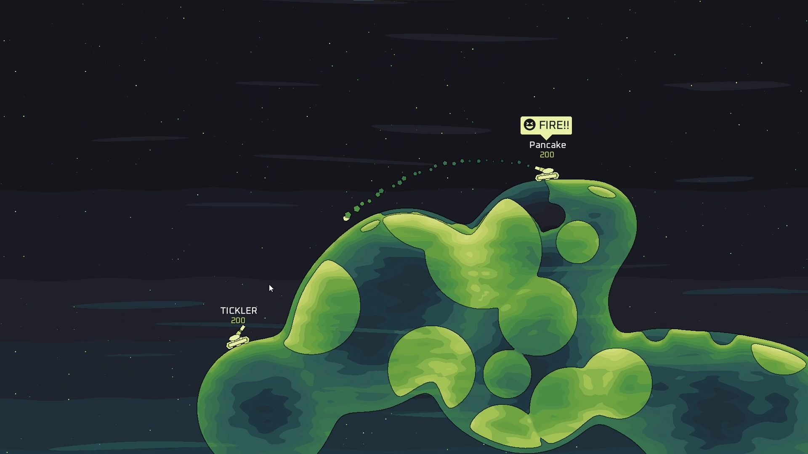

### Solar Storm Press Kit

# About
Solar Storm is a turn-based scifi artillery game, inspired by 90s local-multiplayer games like Scorched Earth and Worms.

Solar Storm releases on Steam **April 3rd 2024** with Windows support.

### Fully Destructible Procedural Maps
Each battle takes place in an unique, procedurally generated arena. There are a number of Biomes, where each one of them has unique characteristics.

### Powerful Weapons of Mass Destruction
There is a wide arsenal of powerful weapons, which can help you out in any circumstances. 
- **Weapon Powerups** which significantly change the weapon
- You can choose a **Weapon Mode** each turn. This impacts whether a projectile explodes on impact, bounces, or drills through the terrain.

### Disasters
Watch out for disaster! Meteorites might be falling from the sky out of nowhere!

## Key Features, Summarized:
- 30+ Biomes, each with unique procedural maps
- Deep weapon system with 40+ powerful Weapons
- Local Multiplayer against players or bots
- Free for All and Team Deatchmatch game modes
- Unexpected Disasters

## Supported Languages
- English
- Simplified Chinese - 简体中文
- Spanish - Deutsch
- German - Čeština
- Czech - Español
- Greek - Ελληνικά
- Russian - Русский
- Swedish - Svenska
- Croatian - Hrvatski
- Portuguese - Português
- Finnish - Suomi
- Turkish - Türkçe
- Dutch - Nederlands

## Price
- $6.99
- €6,89
- £5.89
- 170 CZK

# Contact and Links
- Business Inquiries: jakubtomsu@proton.me
- [Steam](https://store.steampowered.com/app/2754920/Solar_Storm/)
- [Discord Server](https://discord.com/invite/wn5jMMMYe4)
- [YouTube](https://youtube.com/@jakubtomsu)
- [Dev Twitter](https://twitter.com/jakubtomsu_)
- [Handmade Network](https://handmade.network/p/485/solar-storm/)

# Credits
Jakub Tomšů - Game Design, Programming and Art

Dylan Siebert - Soundtrack

# Technology
The entire game is written in the [Odin programming language](https://odin-lang.org) and uses a custom game engine built on [Sokol](https://github.com/floooh/sokol) and [FMOD](https://www.fmod.com/)

The goal is to ensure high quality and good performance, even on low power devices.

# Videos
Demo Trailer



# Logos

# Gifs

# Screenshots

